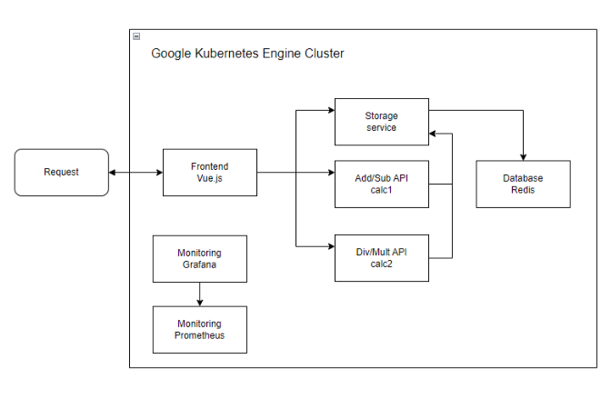
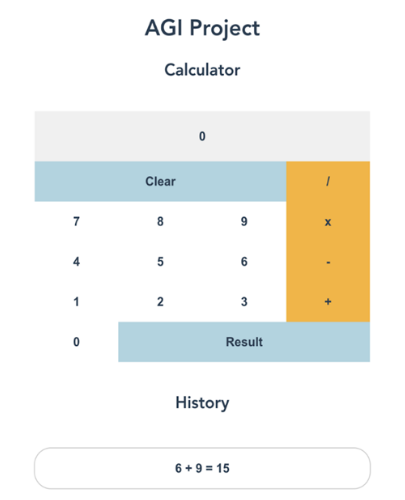
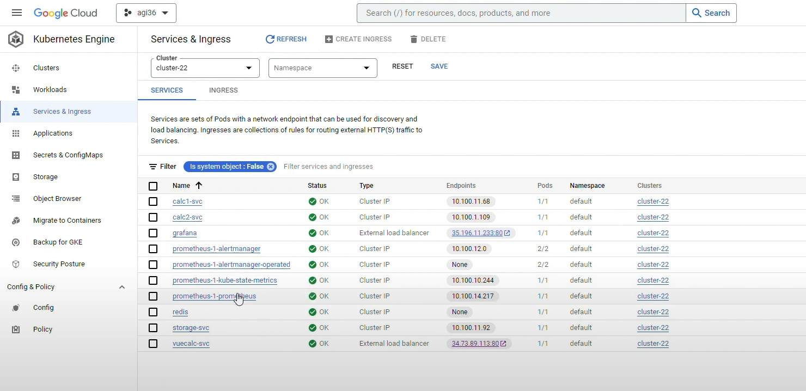
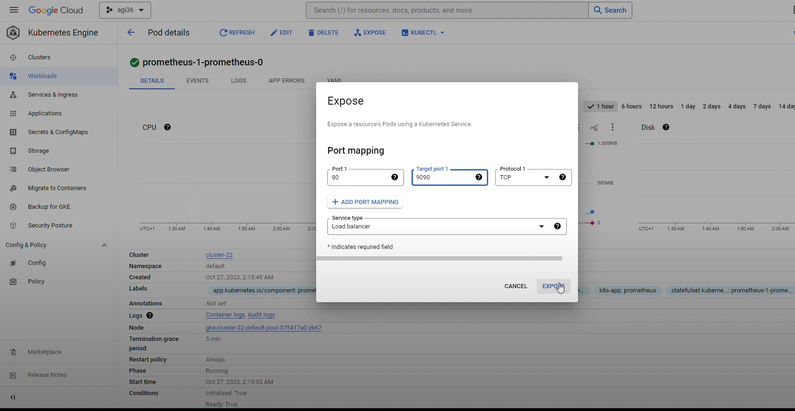
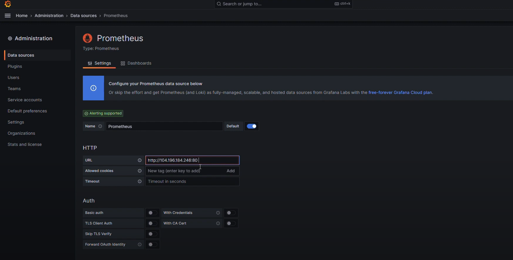
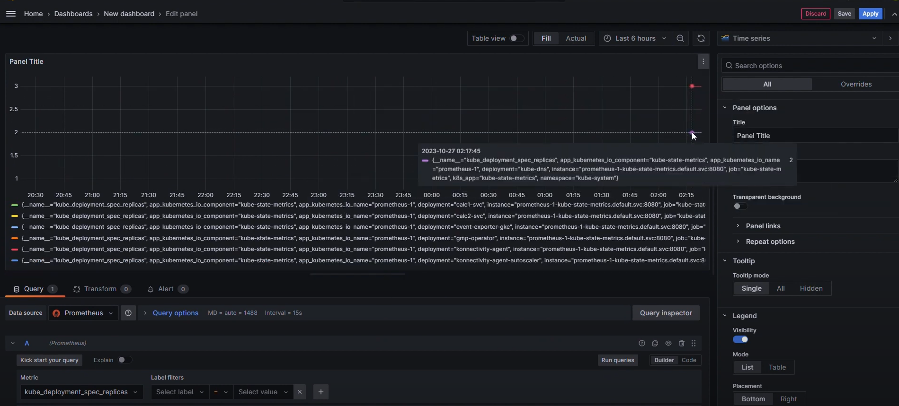
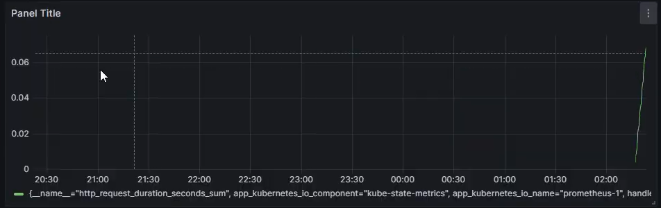

# agisit23-g36 Calculator

Pedro Dias Rodrigues

Sylvain Migeon

Andrey Bortnikov


## Getting started

This project outlines the steps involved in deploying and provisioning a tiered Microservices-based containerized Calculator Web Application on a Public Cloud Provider such as Google Cloud Platform (GCP), using container orchestration tools such as Kubernetes as well implementing instrumentation on the applications, services and infrastructure components of the solution, to allow monitoring features by using tools such as Prometheus and Grafana.

The foundational architecture of the base solution should encompass the following primary services:
Frontend: Serving as the entry point, it exposes an nginx server for the website. Vue.js.
Backend Services: These services deliver the required functionalities. Java Spring Boot
Object Store/Cache/Database: Responsible for data storage. Redis.
Monitoring Server: Offers insights into the system's performance. Prometheus and Grafana.
The diagram below illustrates a typical application architecture:



### Run

In the root directory run the following command:

```
docker-compose up
```

Docker compose will start the following services: frontend(vuecalc), redis, storage, calc1, calc2, prometheus and grafana.
Configuration of the services can be found in the docker-compose.yml file.

### Redis service

Admin UI: http://localhost:8081

### Storage service
Works with Redis db.

Base API url: http://localhost:8000/api/storage

Endpoints:
1. GET /healthz - health check
2. GET /operations - list all saved operations
3. POST /create - create a new operation
4. GET /delete - delete an operation (used for scheduled job to delete old operations)


### calc1 service
Serves the addition and subtract calculator operations.

Base API url: http://localhost:9000/api/calc1

Endpoints:
1. GET /healthz - health check
2. GET /add - add operation for 2 numbers
3. GET /sub - subtract operation for 2 numbers

### calc2 service
Serves the divide and multiply calculator operations.

Base API url: http://localhost:9001/api/calc2

Endpoints:
1. GET /healthz - health check
2. GET /multiply - multiply operation for 2 numbers
3. GET /divide - divide operation for 2 numbers

### Prometheus service
Prometheus collects metrics and manages alerts.
Connected to calc1, calc2 and storage services.
Admin UI: http://localhost:9090

### Grafana service
Grafana visualizes matrices and manages alerts collected by Prometheus.

Admin UI: http://localhost:3000

### Front-end service
Vue allows to access to the calculator and interact with it.

Admin UI: http://localhost:2000

#### Commands Lines

In Google Cloud Platform create a cluster. You can manage your creation because we have to change Boot Disk Size to 10 GB instead of 100 GB inside Nodes' tab.

After it, in CloudShell configure kubectl by runnung:

```
$ gcloud container clusters get-credentials cluster-22 --zone us-east1-b --project agi36-402922
```

```
Fetching cluster endpoint and auth data.
kubeconfig entry generated for cluster-22.
```

Now, clone the project from GitLab, go to root directory and run:

```
$ kubectl apply -f k8s/
```

```
configmap/calc1-config created
service/calc1-svc created
deployment.apps/calc1-svc created
configmap/calc2-config created
service/calc2-svc created
deployment.apps/calc2-svc created
service/grafana created
statefulset.apps/grafana created
cronjob.batch/cronjob created
persistentvolume/calculator-volume created
service/redis created
statefulset.apps/redis created
service/storage-svc created
deployment.apps/storage-svc created
secret/storage-svc created
configmap/vuecalc-env created
service/vuecalc created
deployment.apps/vuecalc-svc created
```

If you access Services & Ingress in Kubernetes Engine Tab you can visualize the IP Address of External Load Balancer. By clicking on it or browsing IP Address you will acess the UI.



Now we have to deploy application from Google Marketplace so we have to move to Applications tab inside Kubernetes Engine.

Click on 'DEPLOY FROM MARKETPLACE' and in Category tab pick Prometheus and configure it (only have to update Existing Kubernetes Cluster and Prometheus Replicas items').

Now, you can verify in Services & Ingress in Kubernetes Engine Tab that Prometheus has been well configured.



After you click on Prometheus-1-prometheus-0, search for Serving Pods, click on it and 'EXPOSE' it.



Now go back to Service & Ingress and verify that had been created a new External Load Balancer.


After a little bit, hit the refresh button and now you can see the EndPoint of Prometheus External Load Balancer. If you click on it, in a new tab, you will check that access occurs without any problem.


Now, click on IP Address of Grafana External Load Balancer and log in. The user is 'admin' and password is 'admin' too.

In the Welcome Menu, you should 'COMPLETE - Add your first data source'.



As you can see in the last figure, you only have to add the URL of Prometheus External Load Balancer, test the connection and save changes.

Now, go back to the Welcome Menu and click on 'DASHBOARDS - Create your first dashboard'. After it, hit '+ Add visualization'.

In Metric choose 'kube_deployment_spec_replicas' and run queries(you can choose different metrics). You will have a panel similar to this one:



After you apply only the painel will be available:




